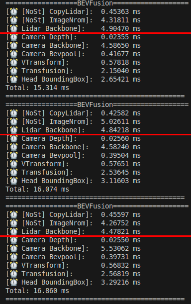
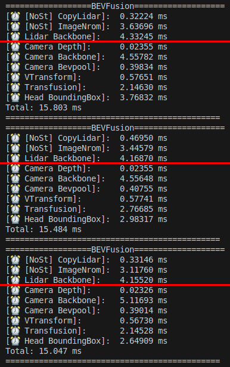

# spconv_deploy

This repo implements the BEVFusion LiDAR Sparse-Convolution (SCN) backbone as a **graph-structured sparse convolution inference engine**, based on [NVIDIA-bevfusion](https://github.com/NVIDIA-AI-IOT/Lidar_AI_Solution). See [blog](https://blog.csdn.net/hehern/article/details/162737208?spm=1001.2014.3001.5501) for details. The sparse convolution engine currently supports **fp16 only** (INT8 is not yet implemented).

## Core Implementation

### Graph-structured inference engine

Instead of running the sparse convolution model through TensorRT, this repo parses the ONNX model (`lidar.backbone.xyz.onnx`) into a **computational graph** and executes it with its own engine (`libraries/3DSparseConvolution/`):

- `Engine` / `EngineBuilder` (`engine.hpp`): builds the graph from ONNX — input tensor, per-node wiring, output tensor — and drives inference by topologically updating each node.
- `INode` (`node.hpp`): abstract graph node with a single `forward(stream)` interface. Implemented node types:
  - `SparseConvolution` — the core sparse conv (submanifold & stride), with rulebook lookup/generation + implicit GEMM
  - `Add`, `Relu`, `Dense`, `Reshape`, `Transpose` — supporting ops
- `SparseDTensor` (`sparse-tensor.hpp`): sparse data flowing between nodes (`features` + `indices` + `grid_size`), with a per-frame **rulebook cache** so convs sharing the same rulebook only compute it once.

Because the engine is a plain graph abstraction over independent operator kernels, it is **portable to non-CUDA ecosystems**: swap the kernel implementations and keep the graph/data-flow layer unchanged.

### Sparse convolution pipeline (rulebook + implicit GEMM)

Each `SparseConvolution` node works in two steps (`node_sparseconv.cpp`):

1. **Rulebook generation** (`getIndicePairsImplicitGemm` in `spconv/spconv_ops.cpp`):
   - Submanifold conv: hash table over output coordinates, then `sort_by_key` + binary search to avoid the original O(N²) linear scan.
   - Stride conv: stage-1 kernel writes the output voxel index for every (kernel position, input voxel) pair → sort + unique to get the unique output-voxel list and count → stage-2 kernel builds a hash table and fills the rulebook (input/output index pairs + per-output kernel-position mask) via binary search.
   - The rulebook is cached in `SparseDTensor` and reused across layers within the same frame.
2. **Implicit GEMM** (`implicit_gemm_cuda` in `spconv/reordering2.cu`): gathers all input features for every kernel position into one contiguous buffer, runs one GEMM per kernel position with a **hand-written tensor-core `conv_kernel`** (WMMA / cp.async, bias + ReLU fused into the epilogue), then scatters-adds all partial results back — a single gather/scatter instead of one per kernel element.

### Dependencies of the sparse convolution engine

- **No TensorRT, no cuDNN, no CUTLASS** for the sparse convolution engine: the graph engine, rulebook kernels, gather/scatter kernels and the tensor-core GEMM (hand-written WMMA, used for all GEMM paths) are all pure CUDA (SM80+). Only the CUDA toolkit is required — the build does not reference CUTLASS at all.
- Camera-side models (camera backbone, view transform, fusion, bbox head) in this BEVFusion repo still run on **TensorRT** engines — they are outside the sparse convolution engine.

### Performance optimizations

- **Best-fit memory pool** (`src/common/tensor.cu`): tensor create/destroy in the hot path reuse pooled device memory instead of bare `cudaMalloc`/`cudaFree` (the latter implicitly syncs the device and drains the GPU pipeline); the pool is pre-filled at startup.
- **Single-pass gather/scatter with fused GEMM epilogue**: all input features across every kernel position are gathered into one contiguous buffer; one tensor-core GEMM per kernel position runs on a hand-written WMMA `conv_kernel` (bias + ReLU fused into the epilogue); then all partial results are scatters-added back in a single pass. Compared with the v1.0 per-kernel Gather→GEMM→ScatterAdd loop, the 27 per-kernel gather/scatter passes collapse into one, cutting kernel launches and data movement while keeping the GPU pipeline busy.

<table align="center">
  <tr>
    <td align="center"></td>
    <td align="center"></td>
  </tr>
</table>

- **Channel alignment** (`C` padded to a multiple of 8) so global loads stay 16-byte vectorized.
- **Sort + binary search** accelerates rulebook generation, replacing the original O(N²) linear scan.

## Performance
Performance comparison between this repo's implementation and NVIDIA's libspconv.so implementation, tested on an RTX-3080 GPU.

<table align="center">
  <tr>
    <td align="center"><br>This repo (v2.0.2)</td>
    <td align="center"><br>NVIDIA libspconv.so</td>
  </tr>
</table>

## Model and Data
- For quick practice, we provide an example data of nuScenes. You can download it from ( [Google Drive](https://drive.google.com/file/d/1RO493RSWyXbyS12yWk5ZzrixAeZQSnL8/view?usp=sharing) ) or ( [Baidu Drive](https://pan.baidu.com/s/1ED6eospSIF8oIQ2unU9WIQ?pwd=mtvt) ). It contains the following:
  1. Camera images in 6 directions.
  2. Transformation matrix of camera/lidar/ego.
  3. Use for bevfusion-pytorch data of example-data.pth, allow export onnx only without depending on the full dataset.
- All models (model.zip) can be downloaded from ( [Google Drive](https://drive.google.com/file/d/1bPt3D07yyVuSuzRAHySZVR2N15RqGHHN/view?usp=sharing) ) or ( [Baidu Drive](https://pan.baidu.com/s/1_6IJTzKlJ8H62W5cUPiSbA?pwd=g6b4) ). It contains the following:
  1. swin-tiny onnx models.
  2. resnet50 onnx and pytorch models.
  3. resnet50 int8 onnx and PTQ models.

## Prerequisites
To build bevfusion, we need to depend on the following libraries:
- CUDA >= 11.0
- CUDNN >= 8.2
- TensorRT >= 8.5.0
- libprotobuf-dev == 3.6.1
- [Compute Capability](https://developer.nvidia.com/cuda-gpus#compute) >= sm_80
- Python >= 3.6

Note: The sparse convolution engine itself only needs **CUDA (SM80+)** — TensorRT/CUDNN are required only for the camera-side models.

## Quick Start for Inference
- note: Please use `git clone --recursive` to pull this repository to ensure the integrity of the dependencies.

### 1. Download models and datas to CUDA-BEVFusion directory
- download model.zip from ( [Google Drive](https://drive.google.com/file/d/1bPt3D07yyVuSuzRAHySZVR2N15RqGHHN/view?usp=sharing) ) or ( [Baidu Drive](https://pan.baidu.com/s/1_6IJTzKlJ8H62W5cUPiSbA?pwd=g6b4) )
- download nuScenes-example-data.zip from 
( [Google Drive](https://drive.google.com/file/d/1RO493RSWyXbyS12yWk5ZzrixAeZQSnL8/view?usp=sharing) ) or ( [Baidu Drive](https://pan.baidu.com/s/1ED6eospSIF8oIQ2unU9WIQ?pwd=mtvt) )
```bash
# download models and datas to CUDA-BEVFusion
cd CUDA-BEVFusion

# unzip models and datas
unzip model.zip
unzip nuScenes-example-data.zip

# here is the directory structure after unzipping
CUDA-BEVFusion
|-- example-data
    |-- 0-FRONT.jpg
    |-- 1-FRONT_RIGHT.jpg
    |-- ...
    |-- camera_intrinsics.tensor
    |-- ...
    |-- example-data.pth
    `-- points.tensor
|-- src
|-- qat
|-- model
    |-- resnet50int8
    |   |-- bevfusion_ptq.pth
    |   |-- camera.backbone.onnx
    |   |-- camera.vtransform.onnx
    |   |-- default.yaml
    |   |-- fuser.onnx
    |   |-- head.bbox.onnx
    |   `-- lidar.backbone.xyz.onnx
    |-- resnet50
    `-- swint
|-- bevfusion
`-- tool
```
### 2. Configure the environment.sh
- Install python dependency libraries
```bash
apt install libprotobuf-dev
pip install onnx
```

- Modify the TensorRT/CUDA/CUDNN/BEVFusion variable values in the tool/environment.sh file.
```bash
# change the path to the directory you are currently using
export TensorRT_Lib=/path/to/TensorRT/lib
export TensorRT_Inc=/path/to/TensorRT/include
export TensorRT_Bin=/path/to/TensorRT/bin

export CUDA_Lib=/path/to/cuda/lib64
export CUDA_Inc=/path/to/cuda/include
export CUDA_Bin=/path/to/cuda/bin
export CUDA_HOME=/path/to/cuda

export CUDNN_Lib=/path/to/cudnn/lib

# resnet50/resnet50int8/swint
export DEBUG_MODEL=resnet50int8

# fp16/int8
export DEBUG_PRECISION=int8
export DEBUG_DATA=example-data
export USE_Python=OFF
```

- Apply the environment to the current terminal.
```bash
. tool/environment.sh
```

### 5. Compile and run

1. Building the models for tensorRT
```bash
bash tool/build_trt_engine.sh
```

2. Compile and run the program
```bash
bash tool/run.sh
```

## Acknowledgements

- Thanks to [spconv](https://github.com/traveller59/spconv) for the reference implementation of sparse convolution.
- Thanks to [NVIDIA-AI-IOT/Lidar_AI_Solution](https://github.com/NVIDIA-AI-IOT/Lidar_AI_Solution/tree/master/libraries/3DSparseConvolution) for the ONNX export and engine building solution.
