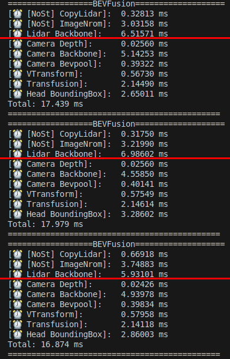
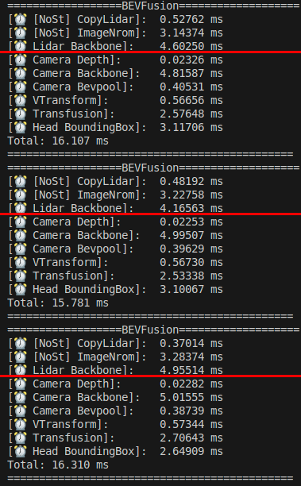

# bevfusion_spconv_deploy

本仓库在 [NVIDIA-bevfusion](https://github.com/NVIDIA-AI-IOT/Lidar_AI_Solution) 基础上，将 BEVFusion 的 LiDAR 稀疏卷积（SCN）骨干网络实现为**自研的、基于图结构的稀疏卷积推理引擎**。详见 [blog](https://blog.csdn.net/hehern/article/details/162737208?spm=1001.2014.3001.5501)。

## 核心实现

### 图结构推理引擎

本仓库不依赖 TensorRT 运行稀疏卷积模型，而是将 ONNX 模型（`lidar.backbone.xyz.onnx`）解析为**计算图**，并用自研引擎（`libraries/3DSparseConvolution/`）执行：

- `Engine` / `EngineBuilder`（`engine.hpp`）：从 ONNX 构建计算图 —— 输入张量、逐节点连接、输出张量，并按拓扑序驱动各节点执行推理。
- `INode`（`node.hpp`）：抽象图节点，统一 `forward(stream)` 接口。已实现的节点类型：
  - `SparseConvolution` —— 核心稀疏卷积（子流形 / 带 stride），负责 rulebook 查表/生成 + implicit GEMM
  - `Add`、`Relu`、`Dense`、`Reshape`、`Transpose` —— 辅助算子
- `SparseDTensor`（`sparse-tensor.hpp`）：节点间流动的稀疏数据（`features` + `indices` + `grid_size`），并带**逐帧 rulebook 缓存**，共享同一 rulebook 的卷积层只计算一次。

由于引擎是建立在独立算子之上的纯图抽象，**易于移植到非 CUDA 生态**：替换 kernel 实现，即可复用图与数据流层。

### 稀疏卷积流程（rulebook + implicit GEMM）

每个 `SparseConvolution` 节点分两步执行（`node_sparseconv.cpp`）：

1. **rulebook 生成**（`getIndicePairsImplicitGemm`，`spconv/spconv_ops.cpp`）：
   - 子流形卷积：对输出坐标建哈希表，再 `sort_by_key` + 二分查找，避免原实现 O(N²) 的线性扫描。
   - 带 stride 卷积：stage-1 kernel 为每个（卷积核位置，输入体素）写入输出体素索引 → sort + unique 得到唯一的输出体素列表与计数 → stage-2 kernel 建哈希表并通过二分查找填充 rulebook（输入/输出索引对 + 每个输出的卷积核位置 mask）。
   - rulebook 缓存在 `SparseDTensor` 中，同一帧内跨层复用。
2. **implicit GEMM**（`implicit_gemm_cuda`，`spconv/reordering2.cu`）：将所有卷积核位置的输入特征一次性 gather 到连续缓冲，按卷积核位置逐个执行 GEMM（**手写 tensor-core `conv_kernel`**，WMMA / cp.async，bias + ReLU 融合进 epilogue），最后一次性 scatter-add 全部部分和 —— 相比逐卷积核 gather/scatter，只需一次。

### 稀疏卷积引擎的依赖

- 稀疏卷积引擎**不依赖 TensorRT、cuDNN、CUTLASS**：图引擎、rulebook kernel、gather/scatter kernel、tensor-core GEMM（手写 WMMA，覆盖所有 GEMM 路径）全部为纯 CUDA（SM80+，fp16），仅需 CUDA toolkit —— 构建过程完全不引用 CUTLASS。
- 本 BEVFusion 仓库中的 camera 侧模型（camera backbone、view transform、fusion、bbox head）仍运行在 **TensorRT** 引擎上 —— 它们位于稀疏卷积引擎之外。

### 性能优化

- **best-fit 内存池**（`src/common/tensor.cu`）：热路径上的 tensor 创建/销毁复用池化显存，替代裸 `cudaMalloc`/`cudaFree`（后者会隐式同步设备、打断 GPU 流水线）；池在启动时预填。
- **单次 gather/scatter + GEMM epilogue 融合**：全部卷积核位置的输入特征一次性 gather 到连续缓冲，按卷积核位置逐个执行手写 WMMA tensor-core `conv_kernel`（bias + ReLU 融合进 epilogue），最后一次性 scatter-add 全部部分和。相比 v1.0 逐卷积核的 Gather→GEMM→ScatterAdd 循环，27 次 gather/scatter 合并为 1 次，kernel 启动与数据搬运大幅减少，GPU 流水线保持忙碌。

<p align="center">
  
  
</p>

- **通道对齐**（`C` 补齐到 8 的倍数），保证全局加载保持 16 字节向量化。
- **sort + 二分查找** 加快 rulebook 生成效率，替代原 O(N²) 线性扫描。

## 模型与数据
- 为便于快速上手，我们提供了 nuScenes 的示例数据，可从（ [Google Drive](https://drive.google.com/file/d/1RO493RSWyXbyS12yWk5ZzrixAeZQSnL8/view?usp=sharing) ）或（ [百度网盘](https://pan.baidu.com/s/1ED6eospSIF8oIQ2unU9WIQ?pwd=mtvt) ）下载，包含：
  1. 6 个方向的相机图像。
  2. 相机/激光雷达/自车的变换矩阵。
  3. 用于 bevfusion-pytorch 的 example-data.pth，无需完整数据集即可导出 onnx。
- 全部模型（model.zip）可从（ [Google Drive](https://drive.google.com/file/d/1bPt3D07yyVuSuzRAHySZVR2N15RqGHHN/view?usp=sharing) ）或（ [百度网盘](https://pan.baidu.com/s/1_6IJTzKlJ8H62W5cUPiSbA?pwd=g6b4) ）下载，包含：
  1. swin-tiny onnx 模型。
  2. resnet50 onnx 与 pytorch 模型。
  3. resnet50 int8 onnx 与 PTQ 模型。

## 环境依赖
构建 bevfusion 需要依赖以下库：
- CUDA >= 11.0
- CUDNN >= 8.2
- TensorRT >= 8.5.0
- libprotobuf-dev == 3.6.1
- [计算能力](https://developer.nvidia.com/cuda-gpus#compute) >= sm_80
- Python >= 3.6

注：稀疏卷积引擎本身只需要 **CUDA（SM80+，fp16）** —— TensorRT/CUDNN 仅用于 camera 侧模型。

性能表中的数据由我们在 Nvidia Orin 平台上测得，使用 TensorRT-8.6、cuda-11.4 与 cudnn8.6。

## 快速开始推理
- 注意：请使用 `git clone --recursive` 拉取本仓库，确保依赖完整。

### 1. 将模型与数据下载到 CUDA-BEVFusion 目录
- 从（ [Google Drive](https://drive.google.com/file/d/1bPt3D07yyVuSuzRAHySZVR2N15RqGHHN/view?usp=sharing) ）或（ [百度网盘](https://pan.baidu.com/s/1_6IJTzKlJ8H62W5cUPiSbA?pwd=g6b4) ）下载 model.zip
- 从（ [Google Drive](https://drive.google.com/file/d/1RO493RSWyXbyS12yWk5ZzrixAeZQSnL8/view?usp=sharing) ）或（ [百度网盘](https://pan.baidu.com/s/1ED6eospSIF8oIQ2unU9WIQ?pwd=mtvt) ）下载 nuScenes-example-data.zip
```bash
# 将模型和数据下载到 CUDA-BEVFusion
cd CUDA-BEVFusion

# 解压模型和数据
unzip model.zip
unzip nuScenes-example-data.zip

# 解压后的目录结构如下
CUDA-BEVFusion
|-- example-data
    |-- 0-FRONT.jpg
    |-- 1-FRONT_RIGHT.jpg
    |-- ...
    |-- camera_intrinsics.tensor
    |-- ...
    |-- example-data.pth
    `-- points.tensor
|-- src
|-- qat
|-- model
    |-- resnet50int8
    |   |-- bevfusion_ptq.pth
    |   |-- camera.backbone.onnx
    |   |-- camera.vtransform.onnx
    |   |-- default.yaml
    |   |-- fuser.onnx
    |   |-- head.bbox.onnx
    |   `-- lidar.backbone.xyz.onnx
    |-- resnet50
    `-- swint
|-- bevfusion
`-- tool
```
### 2. 配置 environment.sh
- 安装 python 依赖库
```bash
apt install libprotobuf-dev
pip install onnx
```

- 修改 tool/environment.sh 中的 TensorRT/CUDA/CUDNN/BEVFusion 变量值
```bash
# 改为你当前使用的路径
export TensorRT_Lib=/path/to/TensorRT/lib
export TensorRT_Inc=/path/to/TensorRT/include
export TensorRT_Bin=/path/to/TensorRT/bin

export CUDA_Lib=/path/to/cuda/lib64
export CUDA_Inc=/path/to/cuda/include
export CUDA_Bin=/path/to/cuda/bin
export CUDA_HOME=/path/to/cuda

export CUDNN_Lib=/path/to/cudnn/lib

# resnet50/resnet50int8/swint
export DEBUG_MODEL=resnet50int8

# fp16/int8
export DEBUG_PRECISION=int8
export DEBUG_DATA=example-data
export USE_Python=OFF
```

- 将环境应用到当前终端
```bash
. tool/environment.sh
```

### 5. 编译并运行

1. 为 tensorRT 构建模型
```bash
bash tool/build_trt_engine.sh
```

2. 编译并运行程序
```bash
bash tool/run.sh
```

## 性能展示
本仓库实现与 NVIDIA 的 libspconv.so 实现在 RTX-3080 GPU 上的性能对比。

<table align="center">
  <tr>
    <td align="center"><br>本仓库实现 (v2.0.0)</td>
    <td align="center"><br>NVIDIA 的 libspconv.so 实现</td>
  </tr>
</table>

## 致谢

- 感谢 [spconv](https://github.com/traveller59/spconv) 提供的稀疏卷积参考实现。
- 感谢 [NVIDIA-AI-IOT/Lidar_AI_Solution](https://github.com/NVIDIA-AI-IOT/Lidar_AI_Solution/tree/master/libraries/3DSparseConvolution) 提供的 ONNX 导出与 engine 构建方案。
